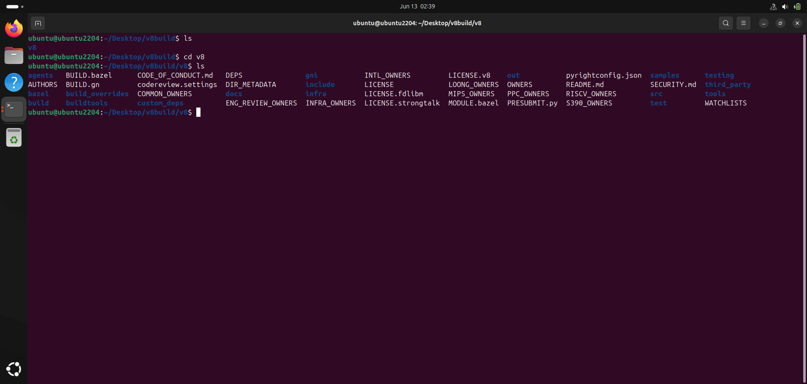
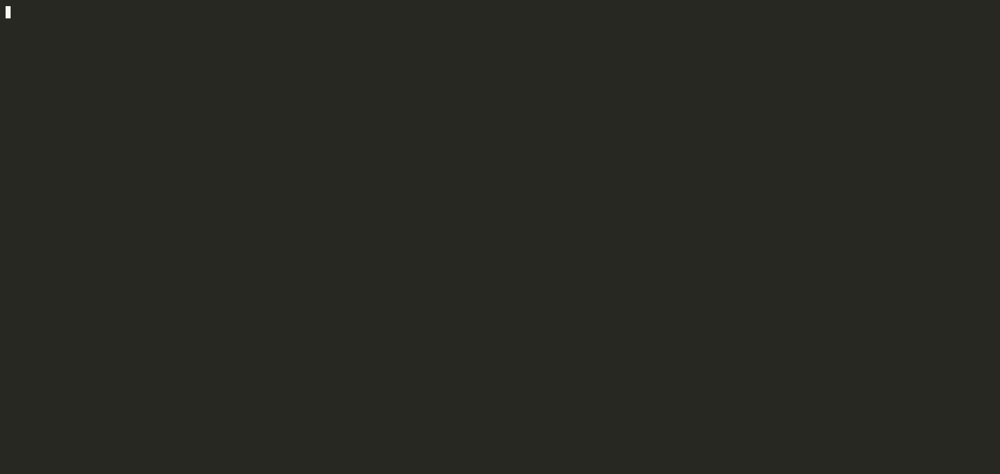
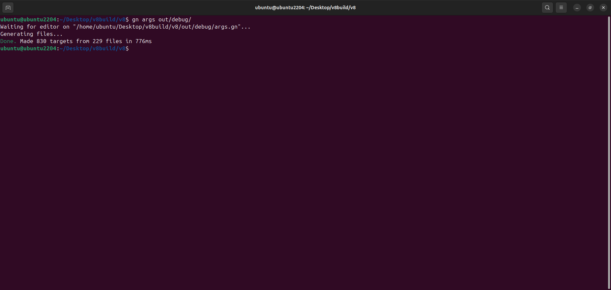
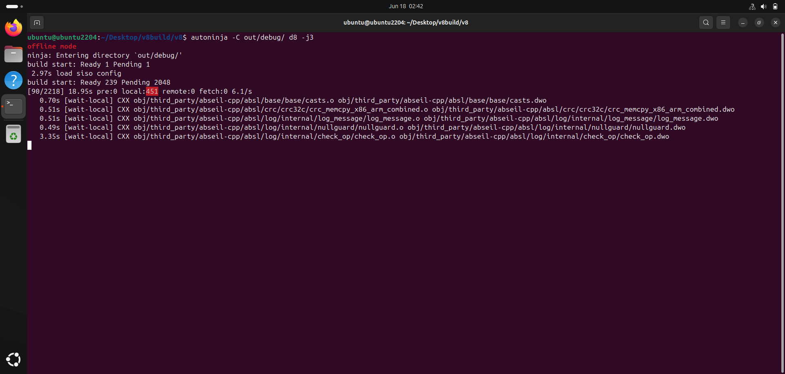
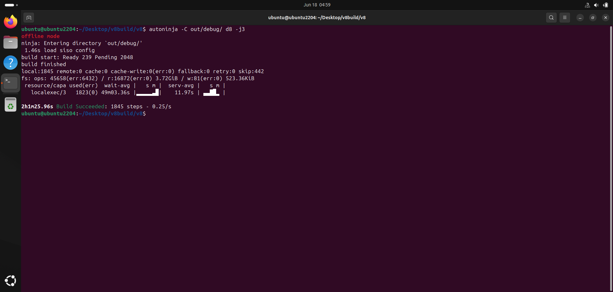
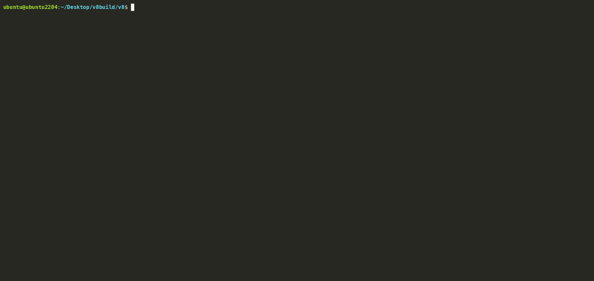

+++
title = 'Building d8 From Source'
date = 2026-06-11T13:46:53-04:00
draft = false
+++

## Introduction
If you are looking to get into browser security, and specifically, into the research of javascript engines, and even more specifically, into the research of Chrome V8, then one of the major tools that must be in your toolbox for this is the debug build of the V8 Javascript engine, which is called d8. d8 offers various auxiliary utilities specifically for debugging and studying v8 internals, such as native functions, which allow you to get information on object memory layout and addresses , JIT optimizations and deoptimizations, bytecodes and so forth. In this article, we will look at the process for building d8 from source and explore the various build options for it.

## System Requirements

[Google's Official Chromium Build Instructions](https://chromium.googlesource.com/chromium/src/+/main/docs/linux/build_instructions.md), states the system requirements to be x86-64 machine , with atleast 8GB of RAM, 16GB RAM being highly recommended, and if you are using and SSD, then set aside >= 32 GB swap space in case of 8GB RAM and >= 16 GB swap in case of 16GB RAM. As we are only interested in V8 and not the entire Chromium build, we need not worry about the higher system requirements.

For this walkthrough, d8 compilation is done on Ubuntu 24.04 virtual machine on VirtualBox which is assigned 4 CPU cores and 4 GB RAM, with 8GB of swap space. My host laptop has AMD Ryzen 7 CPU with 8 cores and has a RAM size of 8GB. If you have lesser number of cores, that is not an issue, however the build time will be quite long.


## Install Basic Dependencies

```bash
sudo apt update

sudo apt install -y \
    git python3 pkg-config \
    build-essential curl \
    clang lld
```

## Getting The V8 Source Code

Following V8's official [Checking Out The V8 Source Code](https://v8.dev/docs/source-code), we install depot-tools and export its path.

```bash
git clone https://chromium.googlesource.com/chromium/tools/depot_tools.git
```
Now export the depot_tools path to the PATH variable. You could either do it on the command line, or you can paste it in your .bashrc file and restart the terminal in case you are not completing the build in one sitting.

```bash
export PATH=/path/to/depot_tools:$PATH
```
Now test if gclient is working, create a directory in which you want to clone the v8 code repository and then get the code.

```bash
gclient
mkdir v8build && cd v8build
fetch v8
```

Wait for a while for the code and dependencies to be downloaded. After the download is complete, we are at this stage.



After this, run gclient sync command.

```bash
gclient sync
```

## Setup V8's Bundled Clang For The Build
V8 uses a specific version of Clang for compiling. If you do not have that specific version of clang, the build system will not be able to find the specific clang dependencies it needs and your build will abort. Fortunately, we do not have to manually match clang versions as the v8 repository already has clang tools in the tools/ folder which will fetch and download the specific clang that v8 will compile with. In the v8 source code directory run the following commands. To avoid version mismatch problems, it is best that you use this bundled clang.

```bash
python3 tools/clang/scripts/update.py 
ls third_party/llvm-build/Release+Asserts/bin/clang
third_party/llvm-build/Release+Asserts/bin/clang --version
```



As we will see next, we will specify to the build system to use this bundled clang by **is_clang = true** option in the args.gn file.

## Generate The Build Directory And Config File Using GN
We can now proceed to generate the build directory where our final d8 binary will be generated. This is done by this command. Make sure you are within the v8 source code directory.

```bash
gn gen out/debug
```

The above command generates an out/debug folder in the v8 repository which contains the build configurations of v8. The particular file of interest in this folder is the args.gn
file which specifies the v8 build configurations we would like to use. To automatically open the args.gn file in your text editor(vim in my case), run the command

```bash
gn args out/debug
```

You will see that the file is currently empty with just a comment. Here, we will place our build options.

You can see all the available build options with -
```bash
gn args out/debug --list
```

You can grep the output of the above command to look for the description of the specific option. Some of the important options here are - 

* **is_debug** - Debug build of v8. However, note that this option will be set to false, because if this is set to true, then the built d8 binary will be very bloated due to lots of debugging symbols. Compiler optimizations will also be turned off which would mean that d8 will run significantly slower and will consume more memory when run, making it very inconvenient for repeated experminents and debugging sessions.

* **dcheck_always_on** - Enable the DCHECK V8 assertion macros. This is also very handy for debugging because failed assertions will trigger a crash dump on screen, allowing us to see where some unexpected behaviour has occured. This will be set to true.

* **symbol_level / v8_symbol_level** - Specifies the level of symbol information we would like to include in the build. Can be set to one of 0(no symbols or stripped) , 1(minimal symbols),2(regular symbols). The value 1 was chosen as it is lightweight considering the hardware limitations. Symbol level 2 includes full symbol information which can increase build times by quite a lot, so I did not go with this. 

* **is_component_build** - Build the components majorly as shared libraries and keep static linkages low. This greatly reduces memory consumption spikes by the linker during the build, so this will be set to true. Due to this, after the build finishes, you would see a bunch of .so files along with the d8 binary.

* **use_custom_libcxx** - Use the libcxx libraries in the third_party folder in the v8 repository and not the system C/C++ libraries. This option will also be set to true as it is best to use the libcxx that comes bundled with v8.
 
* **is_clang** - As mentioned before, when true, this enables use of the bundled clang.

* **clang_use_chrome_plugins** - This option is only true if we are using Chromium's clang for the build. As we are not doing that, this will be false.

* **v8_enable_object_print/v8_enable_disassembler/v8_enable_backtrace/v8_enable_verify_heap** - All these options will be true. They pertain to the various debugging features, like object printing, backtracing and disassembly.

* **v8_enable_sandbox/v8_enable_pointer_compression** - These options will also be true. They pertain to v8 heap hardening.


Now you can copy the following build options into the args.gn file

```
is_debug = false
dcheck_always_on = true

symbol_level = 1
v8_symbol_level = 1

is_component_build = true

use_custom_libcxx = true
treat_warnings_as_errors = false

# Use the bundled clang
is_clang = true
clang_use_chrome_plugins = false

# This enables disassembly and object printing by native functions. A must have for research
v8_enable_object_print = true
v8_enable_disassembler = true
v8_enable_backtrace = true
v8_enable_verify_heap = true

# Harden the d8 build by enabling the v8 heap sandbox and pointer compression
v8_enable_sandbox = true
v8_enable_pointer_compression = true

# These are not necessary 
v8_enable_i18n_support = false
v8_static_library = false

# Target architecture is of course 64-bit x86
target_cpu = "x64"
```
Now, once you copy and save the args.gn file and quit the editor, you will see the following output

 

## Create The 8GB Swap Space
V8's linker jobs can consume significant RAM. So, we need to give some extra legroom to the linker jobs to swap out in case the RAM is less. If we do not do this, heavy linker jobs may end up causing Out Of Memory (OOM) error in the VM, causing VirtualBox to terminate the VM in between the build. So, before starting the build, we will create an 8GB swap file and enable it.

Run the following commands in the terminal

```bash
sudo fallocate -l 8G /swapfile
sudo chmod 600 /swapfile
sudo mkswap /swapfile
sudo swapon /swapfile
echo '/swapfile none swap sw 0 0' | sudo tee -a /etc/fstab
```
To verify that the swap file is enabled, run
```bash
swapon --show
``` 
and see if /swapfile shows up with 8G of size.

## Okay, Lets Roll Now!

Now that we have our swap space and the build arguments and necessary toolchains set up, we can start the D8 compilation. In your host machine, make sure you do not have unnecessary background proceses running, and preferably, you can turn off the internet connection to reduce the effects of the background processes that make network requests.

In the v8's source code directory, run the following
command.

```bash
autoninja -C out/debug d8 -j3
```
In the above command, we specifically tell ninja to build the d8 target in the out/debug folder using the build options that are specified in the args.gn file there and limit the ninja jobs to atmost 3. Now you should see a screen like this, indicating that the compilation has started.



This will take roughly 2 hours to build. Once the build completes, you will see this.



The built d8 binary is now in the out/debug folder. You can now remove the 8GB swapfile that you had set up before starting the build.

## Finally...



And there you have it! Now you can debug and study the various features and components that make v8 tick.
