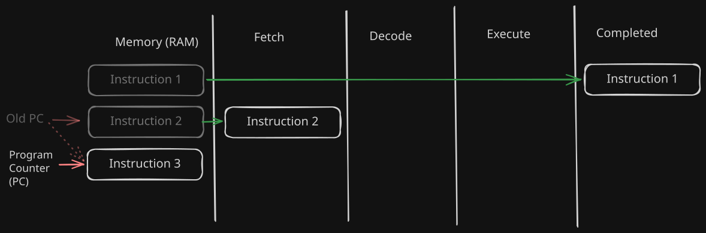
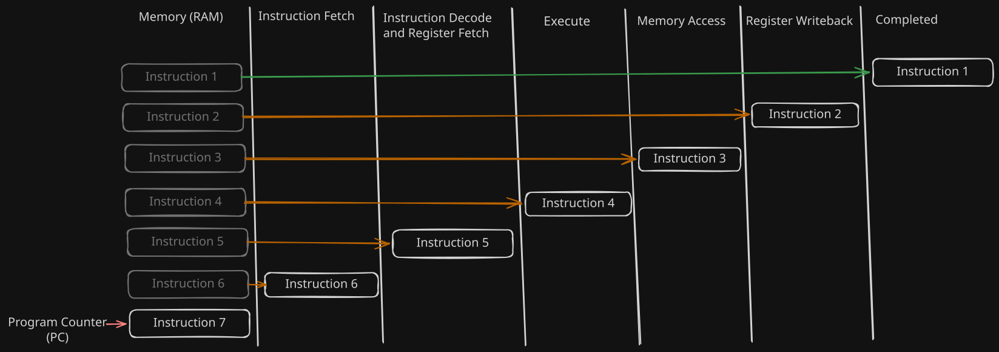
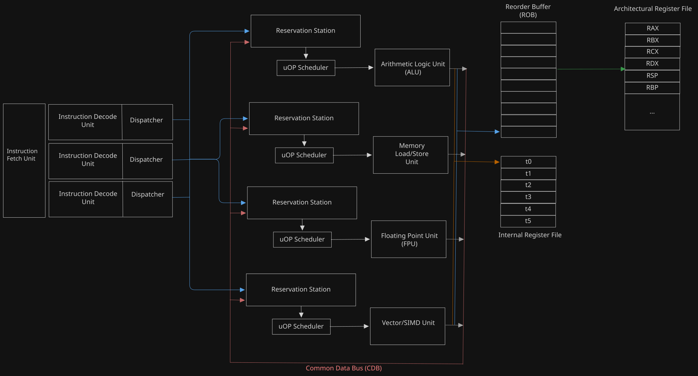

+++
title = 'CPU Side Channel Attacks - Part I'
date = 2026-08-15T05:29:23-04:00
draft = false
ShowToc = true
TocOpen = true
+++

# Introduction

CPU side channel attacks utilize the CPU cache as a 'side channel' or medium to disclose potentially sensitive information from an application or the OS. These sort of attacks are very interesting because it simply takes advantage of the way a CPU executes its instructions and the side effects that result because of it, without exploiting the application at all. There are two aspects of modern CPUs which allow this to happen - out-of-order execution and CPU caching. We need to understand how these work, in order to properly understand how the cache is used as a side channel in attacks like Meltdown and Spectre. This article focuses specifically on **out-of-order** execution.

To properly understand out-of-order execution, we will first need to understand how CPU design started and evolved over the years in order to deliver faster processing speed. We start with the basic single cycle processor and how it evolved into pipelining and later on, into an out of order execution design. We will look at out-of-order execution particularly in greater depth and detail to understand how it really approaches instruction execution under the hood in a radically different way. 

# Understanding Modern CPU Design

## Instruction Set Architecture(ISA)

A CPU executes a sequence of instructions. The Instruction Set Architecture(ISA) specifies the various instructions, their operands, their semantics, memory addressing modes and the general purpose/special purpose registers available to the programmer which they can use in order to express their program logic. Their program will be able to run on the processor which implements that ISA. For example, x86 is an ISA, ARM is an ISA. CPUs implementing x86 can run only x86 assembly programs while ARM CPUs can run only ARM assembly programs and so forth.

## The Single Cycle Processor

Programs are loaded into memory and is executed by the CPU. A program is a sequence of instructions. An instruction is a sequence of bytes which tells the processor what to do.
An instruction follows an instruction encoding format which dictates how the instruction code or opcode, operands, immediate values, memory addresses are encoded at the bit level in order to get the binary representation of that instruction. Instruction length is the number of bytes that the binary encoding of that instruction takes.

Now, when a program is loaded in the memory and needs to be executed, the single cycle CPU follows what is known as a **Fetch - Decode - Execute** cycle.

1. Fetch - The CPU fetches the bytes of instruction from memory. It does this via the Program Counter(PC) register. The PC has the memory address of the next instruction which is to be executed. When the CPU completes the instruction fetch of the current instruction, it increments the PC so that it points to the next instruction.

2. Decode - The fetched instruction bytes are decoded. Here, the CPU follows the instruction encoding format and extracts or decodes the operation code or opcode, the operands, registers, memory, immediate values etc. from the instruction bytes. The CPU now 'knows' what operation to perform and what operands are to be used.

3. Execute - The CPU, based on the opcode and operands, executes the instruction in a series of steps. Each step involves activation of the appropriate circuitry in the CPU to do a particular 'micro operation', like putting data on a bus or reading data from a bus, reading from the register file, performing a computation in the ALU, loading operand from memory, storing to the register file or memory, setting status flag bits in the flags register and so on. The control unit circuitry of the CPU governs the sequence of these micro operations and ensures that the instruction executes correctly and the instruction's semantics are enforced. The control unit is able to achieve this ordering of micro ops using a clock signal, which synchronises the control unit and the other hardware components. 



The instructions execute one at a time, and after the execution of the instruction is complete, the next instruction is fetched and it goes through the same decode and execute phases till completion and this continues till the last program instruction.

The above design is simple, but its performance can still be improved. Instructions here execute sequentially one at a time, but wouldn't it be better if say that while the 4th instruction is being executed, the 5th instruction is being decoded and while the 5th instruction is being decoded, the 6th instruction is fetched? That way, most parts of your CPU are kept busy and more instructions would be completed in a given time slice, meaning faster processing. 

This brings us to the first upgrade in CPU design - Pipelining.

## Pipelining

Pipelining is one approach of executing multiple instructions in parallel, called Instruction Level Parallelism(ILP), by breaking the instruction cycle into multiple stages - forming
a kind of pipeline. Each stage in this pipeline has dedicated hardware circuitry to implement it. Pipeline registers are used to store the results of the particular stage, which serves as input to the next stage in the pipeline. The exact stages in the pipeline depends on the CPU architecture and design decisions but for simplicity, we will discuss the classic RISC pipeline which has 5 stages in its instruction pipeline - 
1. Instruction Fetch
2. Instruction Decode and Register Fetch
3. Execute
4. Memory Access
5. Register Writeback



As seen above, pipelining allows the CPU to process multiple instructions simultaneously above in its different pipeline stages, keeping all parts of the processor busy and increasing
execution speed and throughput.

It all seems fine, until we start to encounter problems in this approach due to two reasons - control flow transfers and certain dependent instructions lead to situations where program correctness is violated. Such conditions are called **Hazards**.
 
### Hazards

When we look at a sequence of instructions, we look at it with the assumption that instructions execute sequentially and the next instruction execution will start only when the
current instruction is completed. Pipelining breaks this assumption.

Consider these two assembly instructions, assuming it executes in the 5 stage RISC pipeline.

```asm
inc rax
mov rbx, rax
```
Obviously, we would expect that the value of rax is incremented first and then moved into rbx. The second instruction's execution depends upon the execution of the first instruction .But, this is not what happens if we follow through with our pipeline.

If `inc rax` is fetched at time t1, then in the Register Writeback stage(Stage 5) of the pipeline which happens at t5, the incremented value will be written back to rax.
Now, `mov rbx, rax` will be fetched at t2 and the rax value to be copied into rbx will be read in the Instruction Decode and Register fetch stage(Stage 2) of the pipeline at t3.
Thus, the move would use the old,stale value of rax instead of the incremented one because it is fetched(at t3) before the writeback even happens(at t5).

Presence of branches and conditionals in the program, which every non-trivial program has, also lands us in a similar problem. Because instructions are fetched sequentially in the pipeline, the instructions of the 'if' block end up in the pipeline and will continue advancing through the pipeline until the condition check's execute stage completes and the branch outcome is finally known. If the condition happens to evaluate to false and the 'else' branch must be taken, the processor has done wasteful work in executing the 'if' block and now the entire pipeline must be flushed and execution must restart from the else block. 
  
To prevent hazards, the hardware employs workarounds, like stalling the pipeline until the dependent instructions complete execution and its results are available to the instruction needing it, operand forwarding, branch prediction etc. 

Pipeline stalls are a common occurence in non-trivial programs. However, there is one situation caused due to pipeline stalling which is detrimental to performance - Instructions independent of whatever instruction causes the stall, now has to be stalled as well, when the processor could have executed it. For example - 

```asm
1. mov rax , QWORD[rbp-0x24]
2. shl rax,3
3. add rdi, rbx
4. sub rsi, 0x1337
``` 
Here, instruction 2 can execute only when the value is loaded from memory into rax in instruction 1. Instructions 3 and 4 are independent of 1 and 2. However, an in-order pipeline would stall at instruction 2 in order to wait for the memory read and register writeback of instruction 1 to finish. Instructions 3 and 4, which could have been executed in the meantime, end up getting stalled as well in the pipeline.

Now, what if the CPU could march ahead and execute instructions which are independent, putting more of the hardware to use and wasting less clock cycles ,while the dependent instructions complete? This required a very different design approach which culminated into the **Out-Of-Order Execution** CPU design.

## Out Of Order Execution

Modern processors are designed to execute instructions out of order. Out-of-Order execution makes optimal use of CPU hardware and clock cycles by prioritizing instruction execution on the basis of data availability rather than instruction ordering, while ensuring data consistency and program correctness is still intact.

There are two reconsiderations made so that instructions can be executed out of order - 

1. Processor design is more data flow centric and computational units centric. Instead of tying down execution units to specific pipeline stages, we dispatch data and instructions to the appropriate execution unit and obtain the result. Now, this requires a fundamental change in how we see instructions itself.

2. The instructions themselves are broken down into smaller and simpler micro-operations. The instruction decode unit is responsible for taking in the instruction bytes and breaking it down into its respective micro-ops. These micro-ops are then sent to the various execution units with their respective operands and the execution is carried out. Thus, execution units do not see the full instruction, they see micro-ops and their bundled operands.

The **Tomasulo Algorithm** , which was developed by Robert Tomasulo at IBM in 1967, is a hardware algorithm for dynamic scheduling of instructions which allows efficient use of compute units and out-of-order execution in a processor. This algorithm introduces fundamental hardware components and concepts to implement out of order execution correctly in processors - 
1. Instruction Decoder.
2. Execution units for different kinds of operations and computations. 
3. Reservation stations for each execution unit
4. Common Data Bus(CDB)
5. Reorder buffer(ROB)
6. Register Renaming - This is the most important concept because it plays a major role in program correctness by completely eliminating Write after Write(WaW) and Write after Read(WaR) hazards in the execution flow.


### Out of Order Engine Components



The schematic above shows the various components in the CPU's Out of Order execution engine and their interactions.

1. The instruction fetch unit fetches multiple instructions from memory at once and sends them off to the instruction decoder units.

2. The instruction decode unit decodes the instructions and breaks it down into its micro-ops. The dispatcher component of the decoder is responsible for taking these micro-ops and sending it to the appropriate reservation station where it will await its execution by its respective execution unit.

3. The reservation station is a content addressable memory which holds the micro-operations that are awaiting execution. Micro-ops may not be ready for execution, because they require the result of a previous micro-op as input, and so they wait for it. micro-ops get the input data they depend on from the Common Data Bus(CDB), which all reservation stations listen on. CDB is highlighted in red in the schematic.

4. The uOP scheduler is the component which continuously monitors the reservation station for micro-ops that are ready to execute. Based on its designed scheduling policy, it picks a particular micro-operation which is ready for execution and dispatches it to the execution unit. Note that the operands of the micro-op are bundled with the micro-op itself, in order to avoid stalling due to additional writebacks.

5. The execution unit takes the micro-op with its bundled operands and then performs the corresponding operation to yield a result. The result of the micro-op execution
    * is written in the designated slot of the micro-op in the Reorder Buffer(ROB).
    * is placed on the common data bus(CDB) for the waiting micro-ops which depend on it.
    * May be written to the internal register file if necessary.

6. The re-order buffer(ROB), holds the result slots for the micro-operations in the program order. This component ensures instruction ordering is maintained. Every decoded micro-op is assigned a slot in the ROB by the instruction decoder where its result will be stored. The slots are assigned in the correct order. This is the key thing to note - Micro-op execution happens out of order, but their results are arranged in the ROB in-order. The ROB performs what is known as micro-op **retirement**. When a micro-op's execution is complete and its result is in the ROB slot, the ROB retires the micro-op by committing its result to the appropriate architectural component and register file and freeing up its slot for fresh micro-ops. However, note that just because a micro-op's result is in the ROB does not mean it can be retired immediately. A micro-op can only be retired **if all its preceding micro-ops have been retired** , otherwise, you have not maintained program order and violated program correctness. Thus a micro-op waits for retirement in the ROB.

### Register Renaming and False Dependencies

Register renaming, as mentioned before, is important as it eliminates WaR and WaW hazards, which are also called false dependencies between instructions. False dependencies are artificial dependencies that occur just because two independent instructions happen to use the same destination register. While the actual details are a bit involved and they are not really necessary to know, the key point to understand about the concept of register renaming is that the architectural registers - which are the actual registers that programmers and instructions can name, are decoupled from the execution process and a separate internal register file is used by the execution engine to perform register writebacks.

When the decoder decodes the instruction and breaks it into micro-ops, it also does the **register renaming** procedure, by changing architectural register encodings to that of the 'scratchpad' registers within its own internal register file. Thus, the micro-ops have no awareness of the architectural registers at all. The only other component which has awareness of the archtectural state is the ROB which will commit the results to the architectural registers in-order.

Thus the instruction decoder, the internal register file, and the ROB working together like this,isolate the architectural state from the absolute chaos ensuing due to out-of-order execution. This is also why you are never able to see the effects of out of order execution by simply seeing your register values in the debugger - because debuggers show you the architectural state of the CPU and the ROB makes its commits in-order, which completely conceals the fact that the execution is happening out of order.

### Common Data Bus and True Dependencies

True dependencies are also called Read after Write(RaW) hazards in computer architecture. This is the dependency that occurs because one instruction needs the result of another instruction to execute correctly. Unlike false dependencies, true dependencies cannot be eleiminated and moreover, true dependencies allow you to express non trivial and complex program logic in the first place. So, how are true dependencies resolved quickly? The answer is the common data bus(CDB).

Every execution unit is connected to the common data bus as a sender and every reservation station listens on the common data bus as a recipient. When a micro-op's result is obtained by an execution unit, along with writing the result to the ROB slot, it simultaneuosly puts the result onto the common data bus along with a tag identifier. This tag identifer uniquely identifies a micro-op that is waiting in one of the reservation stations. Now all reservation stations listen on the CDB, but only the micro-op whose tag value matches the one on the bus will respond. The concerned micro-op reads the data value it depends on from the CDB, and marks itself as ready for execution, so that the uOP scheduler can now select and dispatch it.

Thus in this way, the CDB resolves true dependencies efficiently, by making data available to the dependent micro-ops as soon as it is computed, without having to do a writeback operation.

The exact details about how this sort of operation is implemented in hardware is a another subject of its own and is beyond the scope of this blog and is not necessary. The key takeaway from this discussion is that micro-ops have data dependencies between them and the common data bus is the mechanism to propagate that data as soon as it is computed or fetched.

### Lifecycle of a Micro-Operation

Now, keeping all of the above facts in mind about out of order execution, lets trace step-by step what happens to a micro-op as it moves through the CPU.

1. The instruction decoder decodes the instruction, breaks it down into its micro-operations, performs register renaming, and for each micro-operation, creates its appropriate slots in the re-order buffer, in the correct order.

2. The dispatcher component of the decoder, takes the micro-op and based on the kind of operation(arithmetic, memory R/W, floating point, SIMD etc.) routes it to the correct reservation station for that operation. In the reservation station, the micro-op gets placed in the first empty available slot in the reservation station.

3. This micro-op depends on some other micro-op before it for some data, and so it is currently not ready for execution, so it waits for that data. 

4. Some data has been placed on the CDB. On checking the tag value, it matches the tag id of this micro-op. This is the data which it needed. Now, it reads in the data, and marks itself ready for execution.

5. The scheduler picks up this micro-op and dispatches it to the execution unit which now does the operation and produces the result.

6. The result gets written to its slot in the ROB, and at the same time, that result is placed on the CDB, so that the micro-op which needs that value and is waiting for it, can now avail it. A register writeback to the internal register file may also be done.

7. The micro-op execution is finished and now, its result waits in the ROB to be committed to the architectural registers. Once that is done, the micro-op has been retired successfully.

## Conclusion and Key Takeaways

That was a lot of theory and details to unpack about processors, but this is necessary for fully understanding the aspects of modern CPUs which introduces certain behaviours that can be leveraged in CPU based attacks. All the discussions above can be boiled down to a few key takeaways when we consider security at the microarchitecture level-

1. Instructions themselves are not fully fundamental - An instruction is further broken down into its sequence of micro-operations.
2. The smallest unit of execution in a modern CPU is not an instruction, it is a micro-operation.
3. Micro-op execution happens out-of-order, but their retirement always happens **in-order**. For a micro-op to be retired, first, all the micro-ops preceding it must be retired.
4. The architectural registers are the registers which are visible to the programmer and they can write instructions and programs which operate on them.
5. The architectural registers are decoupled from the execution process of instructions. Computations are done internally and independently and the results are committed to the architectural registers in-order, giving the illusion that the execution of instructions is happening sequentially.

In the next part, we will take a look at CPU Caching and how its effects can be measured in software, which enables us to use it as a side channel of information.

## References

- **BitLemon Software's Youtube video** - https://www.youtube.com/watch?v=EzEKGlO9w4Y
- https://en.wikipedia.org/wiki/Instruction_pipelining
- https://en.wikipedia.org/wiki/Tomasulo%27s_algorithm
- https://en.wikipedia.org/wiki/Out-of-order_execution 
 
**Next** : [CPU Side Channel Attacks Part II - The CPU Cache]()
