+++
title = 'CPU Side Channel Attacks Part-II - CPU Cache'
date = 2026-09-03T11:02:23-04:00
draft = false
ShowToc = true
TocOpen = true
+++

## Introduction

In the previous blog post, we looked in great depth the out-of-order execution design of processors and how instruction execute in this design. In this part, we will look in detail
the component of the CPU which serves as the 'side channel' of information - the CPU cache.

## Basics Of The CPU Cache

### The Cache Hierarchy

The CPU cache is a fast memory close to the CPU core which is used to speed up memory access operations. Memory operates at a much slower speed than the CPU, which causes the CPU to wait for many clock cycles for the memory operation to complete. The CPU cache is additional memory on chip which addresses this issue. When the CPU reads from memory, it stores the data within its cache memory. The next time when the CPU needs to access that same memory location, it checks the cache for the data, and if it is found there, then the CPU reads it from the cache itself, without having to reach out to the main memory, thus saving time and increasing performance. The CPU always checks its cache memory for data before going out to main memory. If the data is found in the cache, then it is called a **cache hit** and the CPU can use it. If the data is not found in the cache, then it is called a **cache miss** and the CPU must reach out to the main memory for the data, paying a performance cost.

There are two central principles which caching is based on
1. Temporal locality of reference - When a memory address is accessed once, it will most likely be accessed again and so it is cached. This makes sense in a lot of programming constructs like loop counters for example.

2. Spatial locality of reference - When a memory address is accessed, there is a high chance that the adjacent memory addresses will be accessed as well. Thus along with the currently accessed memory location, the adjacent memory locations must also be cached. This helps in speeding up access of array elements and structure members in programs. This behaviour of the CPU is also called **prefetching**, where the CPU fetches adjacent memory contents and caches them as well, ahead of time, anticipating their subsequent access.

Generally, the CPU cache is not a single block of memory soldered on the CPU. Rather, it is organized in tiers or levels, as depicted below - 

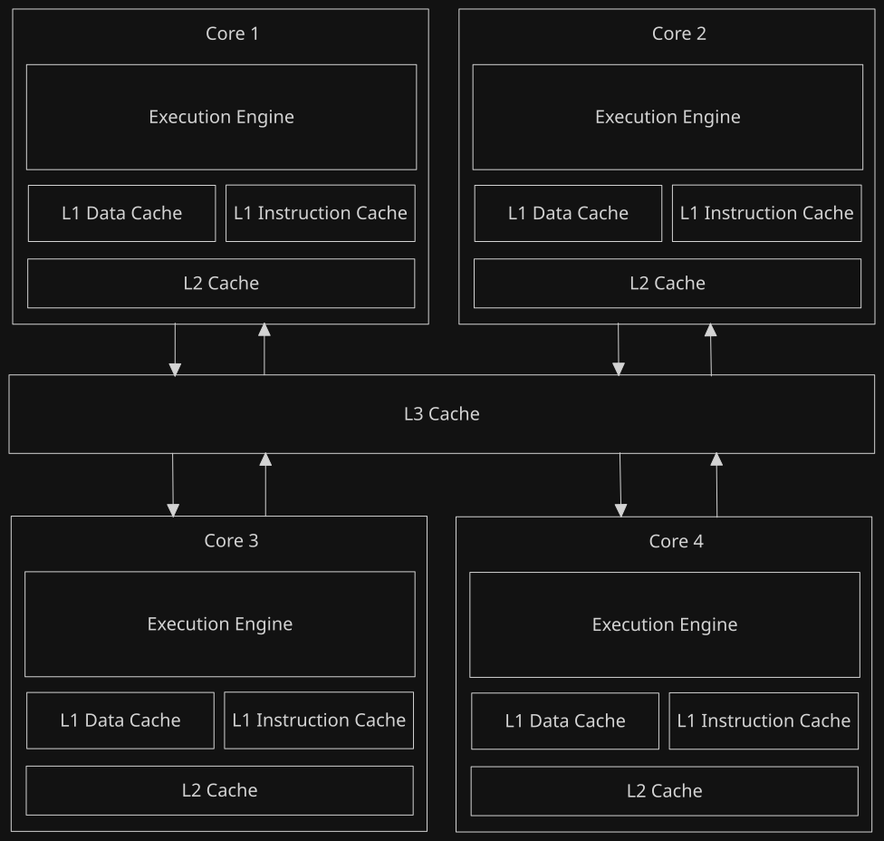

There are three layers of caches - L1, L2 and L3. As the layers progress - the cost decreases, access time increases, and the cache's storage capacity increases.

1. **L1 Cache** - This is the first layer of cache, designed to be small and match the processor's speed. L1 cache is divided into two separate components - the L1 data cache - which specializes in caching data and the L1 instruction cache - which specializes in caching instructions and make instruction fetching and execution much faster. L1 caches are small in capacity ranging from 16KB to 128 KB, and are quite expensive. But, they are extremely fast to access. Each CPU core has its own L1 cache.

2. **L2 Cache** - To address the size limitations of the L1 cache, CPU cores have an additional L2 cache, which is designed to be larger in size, but it works at slower speed compared to L1 cache. The L2 cache is unified, meaning it can store both data and instructions. It directly communicates with the L1 cache. L2 cache capacity is larger than L1 - going roughly from 256KB to 2MB.

3. **L3 Cache** - the L3 cache is shared among all CPU cores. It is an additional caching layer between the main memory and the CPU cores. It also serves as a medium for two CPU cores to exchange data with each other fast, without using the main memory. The L3 cache is larger than L2 cache in storage, ranging from roughly 2MB to 32MB and is slower than the L2 cache to access.


Each core has its own L1 and L2 caches, while L3 cache is a single cache shared among all cores. A CPU core accesses memory in the this order: 
L1 ---> L2(if cache miss in L1) ---> L3(if cache miss in L2) ---> main memory(data not present in any of the caches).

In terms of access speed from fastest to slowest we have-
1. L1 cache (Latency 1 to 3 CPU cycles)
2. L2 cache (Latency 4 to 10 CPU cycles)
3. L3 cache (Latency 10 to 40 CPU cycles)
4. Main memory(Latency is a couple hundreds to thousands of CPU cycles) 

Thus we see that no matter what the level of cache is, it will be significantly faster than accessing memory.

Now that we have seen the CPU cache hirearchy, we need to just take a brief look at how data is organized within the cache in **cache lines**.

### Cache Lines

The cache stores cached data into cache lines. A cache line is the smallest unit of data a cache can transfer. Depending on the architecture - cache line sizes are 32-byte , 64-byte or 128-bytes, with 64-byte cache lines being the most common. If you want to see how big your processor's cache lines are, on Linux systems, you can run the `cat /proc/cpuinfo` command.

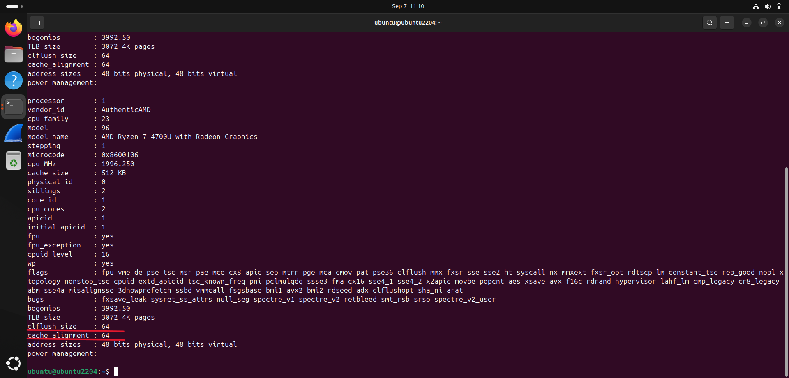

Note the **clflush size** and the **cache_alignment** size, which are underlined above, both read 64 which implies that cache lines are 64 bytes wide. 

Now, cache lines are tagged and have an additional tag field appended to it, which tells the general location where the data came from in main memory. The cache lines are divided into
multiple **sets**. Single cache lines taken from each set form a column of cache lines called a **bank** or a **way**. Thus the arrangement of cache lines is grid like - with rows representing sets and columns representing ways. It can be visualized like this - 

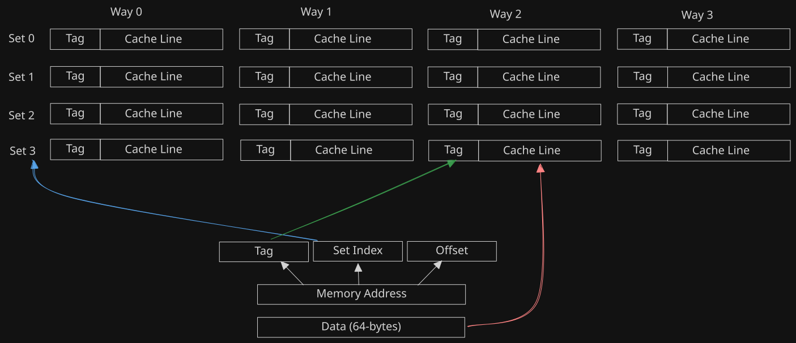

Such caches are called N-way set associative cache. The one illustrated above is a 4-way set associative cache. 

When a memory read happens at an address , an entire 64-byte block is read from memory, so that it fits within the cache line. In order to interact with the cache, the memory address is broken down into 3 parts - The tag bits, set index bits to identify the set number, and the offset bits. The number of bits of these three fields depend on the size of memory addresses, number of sets in the cache, and the cache line size respectively.

When the CPU has to cache a data block, the cache takes the **set index** field from the memory address and determines the set number from which the cache line will be selected. In that set, the next free available cache line is picked, and the data block is now stored in that cache line along with the **tag** field identified by the memory address.

Now, when the CPU has to read some bytes at or around that address and it asks the cache for it, the cache uses the **tag** bits and **set index** bits to pinpoint the exact cache line requested, and it gives the CPU the entire 64-byte data block from there. The CPU now uses the **offset** field from the memory address to index into this data block and read the exact byte or bytes it needs from that block.

There are many cache designs which organize cache memory differently - each having their own pros and cons in terms of cost effectiveness and performance. All the inner complex details about caching is beyond the scope of this series and is not required.

The key thing to understand from all of the discussion above is that caches - no matter its design and no matter its level in the hierarchy, speeds up memory accesses drastically. The cache also organises cached data into blocks of a fixed size called a cache line. Now, after understanding the caching layers and cache lines, it is time to get to the main part - how can we weaponise it?

## Implications Of The Cache

Now, if the cache speeds up memory access, then as a consequence, it takes much less time to read the value from it, as compared to main memory. So, we can generally say

Cached data => Small access time and
Uncached data => large access time

Now, what information can we learn from this time difference? 

Before we can properly and reliably answer this question, there are a few considerations we must address - 
1. How do we measure memory access time ?
2. When we say that cached data has small access times, how 'small' are we talking about? Memory access times can fluctuate due to a variety of reasons and this data is really noisy. In all this noise, how can we say that some accesses have been cache hits?

Let's turn our attention to the first question - **measuring memory access times**. Note that for the programs and experiments that follow, an x86 based machine is assumed. 
My processor is AMD Ryzen 7 4000 Series and I have compiled and run the programs on Ubuntu 24.04 VM running on VirtualBox.

## Measuring Access Times

### rdtsc and Intrinsics

One quick and simple way of measuring the memory access time is using the **rdtsc** assembly instruction on x86, which reads the timestamp counter register(TSC) value. The TSC register is a 64-bit register on x86 which acts as a clock cycle counter - it increments on every CPU clock tick. On Linux, you can include the x86intrin.h header file in your C code to access the various processor intrinsics, which includes the `__rtdsc()` function that allows you to read the TSC value from C itself. 

```C
#include <stdio.h>
#include <x86intrin.h>  //Processor intrinsics
#include <stdint.h>

int main()
{
    uint64_t tsc = __rdtsc();  //Read the timestamp value
    printf("Timestamp = %li\n", tsc);
    return 0;
}

```
On running the above C program, we see that we can access and print the timestamp counter which tells how many CPU clock ticks have elapsed.

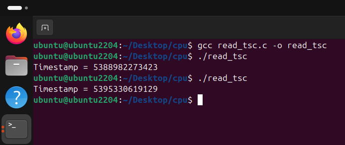

We could use sleep() or nanosleep() system calls to measure the time, but they are not a reliable way to do so, because they introduce errors in the measurement due to overhead by system call and process/thread scheduling. rdtsc in constrast simply reads from a register and is fast and small, with little to no errors due to delay. Thus, we will measure memory
access times in terms of **CPU clock ticks** rather than seconds or nanoseconds.

### The Naive Stopwatch

Now that we have figured out how we are going to measure time, lets use it to time memory accesses. This is easy - Before the memory access, record the starting timestamp, and after the memory access completes, record the ending timestamp and then, calculate (end - start) in order to find out the access time. So , the code is as - 

```C
#include <stdio.h>
#include <x86intrin.h>
#include <stdint.h>

int main()
{
    char buf[128];
    uint64_t start = 0,end=0;
    
    start = __rdtsc(); // Record start timestamp
    /* Perform memory access of buf
       x is declared volatile to prevent the compiler from optimizing it away because it is not used.
    */

    volatile char x = buf[2];  
    end = __rdtsc();

    uint64_t acc_time = end - start;
    printf("Memory access time = %li\n", acc_time);
    return 0;
}

```

On running the above program a couple of times, we see this. 

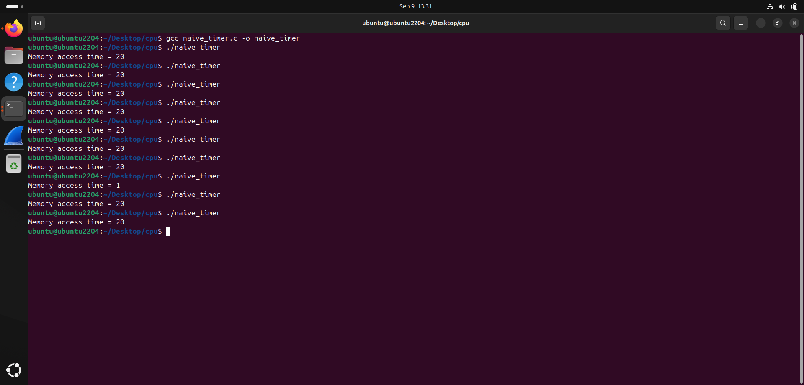

That is really odd. We see that the access time is really quick most of the time - 20 clock ticks and there is one case where it took just 1 clock tick. But how can this be? The logic
is correct, right? Well, there is still something missing. This way of calculating access times assumes that first the start timestamp is read, then the memory access happens and finishes, and then the end timestamp is read, in sequence. But as seen in the previous blog post, CPU instructions execute **out-of-order** ! Thus, it could be that the start and end timestamp counters are read before the memory access even starts, or the end timestamp counter is read prematurely, before the memory access even completes, or memory access completes before the start timestamp's micro-ops are even scheduled to run! So this code above fails to time the memory access at all. More technically, **rdtsc** is a **non serializing** instruction, meaning the CPU can execute instructions around it out-of-order and so if you are using it vanilla for timing and benchmarking, you will get incorrect results.

What we need to do now, is to strictly ensure instruction ordering during execution - The memory read starts only after the start timestamp read is complete and the end timestamp is read only after the memory read completes. But how do we do that in a fundamentally out-of-order execution processor? The CPU provides us with a way to enforce execution ordering through the concept of **fences** .

### Fences to the Rescue!    

A memory barrier or a memory fence is a CPU instruction, which enforces an ordering constraint on memory operations relative to it. A memory fence guarantees that memory operations occuring before it will be conpleted before the memory operations that will occur after it. Thus, in a way, memory fences allow us to some extent, enforce a sequential ordering of memory operations which otherwise, would be happening out-of-order. In x86, there are 3 types of memory fences, covered by 3 distinct assembly instructions - 
1. Load Fence(lfence instruction) - lfence is memory load fence or load barrier instruction. This instruction ensures that all memory loads occuring before it complete before any memory load occuring after it start executing. For example - 

```asm
1. mov rax, QWORD[rbp-0x18]
2. lfence
3. mov rbx, QWORD[rbp - 0x28] 
``` 
Here, lfence instruction at 2, guarantees that the memory load 1 will complete its execution before memory load 3 starts executing. More specifically, memory load 3 will start its execution only after the lfence instruction at 2 **retires**. Thus, there is now execution ordering between 1 and 3.

2. Store fence(sfence instruction) - sfence is store fence or memory store barrier. This works in almost the same way as lfence, except that it specifically orders memory store operations instead of load operations. The sample assembly code below shows us sfence in action, ordering the execution memory stores-

```asm
1. mov QWORD[rbp-0x18], rax
2. sfence
3. mov QWORD[rbp - 0x28], rbx
```

3. Memory fence(mfence instruction) - This is the full memory barrier. This deals with both load and store memory operations. mfence ensures that all memory operations occuring before it will complete before any memory operation after it starts.

Now, as mentioned before, rdtsc is non serializing. Therefore, it must be paired with a fencing instruction in order to serialize instructions around it and ensure it is executed in the right order. Now,the question is which fence is suitable here? It is **lfence** . There is another detail about lfence - lfence actually does a bit more than just serializing loads,
**it serializes the entire instruction pipeline**. This is because Intel and AMD have designed it in this way, it serializes not just memory loads, but also register-register loads as well, including reading the TSC register. **sfence** only serializes memory stores and it does not have any effect on the instruction pipeline, so it simply does not do the job here.
**mfence** can also be used, but because it deals with both loads and stores, serializing memory stores adds overhead and introduces noise in the measured time. Thus, **lfence** is the choice for the memory barrier in this situation.

### The Accurate Stopwatch

With the knowledge of fences, we can improve our timer and make it accurate like this - 

```C
uint64_t measure_access_time(char* target_memaddr)
{
	uint64_t end=0,start=0;
	
    //Serialize the instruction pipeline. Finish all reads and then read the start timestamp.
	_mm_lfence();
	start = __rdtsc(); // Read TSC for start.
	_mm_lfence(); //Wait for TSC read to finish. Do not start memory read until then.
	
	volatile char x = *target_memaddr; // Read the target memory.
	
	_mm_lfence(); // Wait for memory read to finish. Do not read end timestamp until then.

	//Read the end timestamp
	end = __rdtsc();

	return (end - start);
}
```

The fences are available as instrinsics - `_mm_lfence()` , `_mm_sfence()` and `_mm_mfence()`. The full C code to test this out is as - 

```C
#include <stdio.h>
#include <x86intrin.h>
#include <stdint.h>

uint64_t measure_access_time(char* target_memaddr)
{
	uint64_t end=0,start=0;
	//Serialize the instruction pipeline. Finish all reads and then read the start timestamp.
	_mm_lfence();
	start = __rdtsc(); // Read TSC for start.
	_mm_lfence(); //Wait for TSC read to finish. Do not start memory read until then.
	
	volatile char x = *target_memaddr; // Read the target memory.
	
	_mm_lfence(); // Wait for memory read to finish. Do not read end timestamp until then.

	//Read the end timestamp
	end = __rdtsc();

	return (end - start);
}


int main()
{
    char buf[128];
    uint64_t start = 0,end=0;

    //Flush the cache lines to force memory read.
    _mm_clflush(buf);
    _mm_clflush(&buf[64]);

    uint64_t acc_time = measure_access_time(&buf[2]);
    printf("Memory access time = %li\n", acc_time);
    return 0;
}
```

On compiling and running the above code, we see this output - 

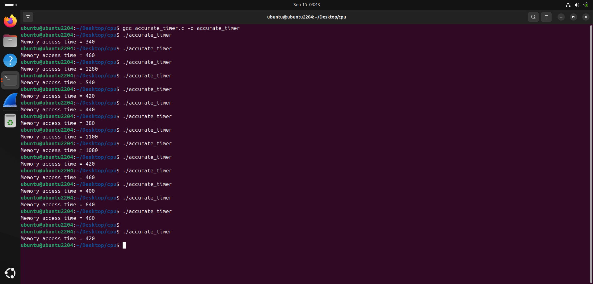

Now we see accurate results, memory reads are taking anywhere from 350 to some 1000 clock ticks to complete. Note that `_mm_clflush()` intrinsic is used to flush the target
`buf` array's cache lines and empty them, so that the read is forced to go to RAM. `_mm_clflush()` will be seen again later when we use **flush and reload** technique, to prepare the target cache lines before the attack is done.

Now we turn our attention to the second question - In all these memory accesses, when we look at the memory access time data, how can we say that yes, this was a cache hit or no, this went to RAM?

## Profiling The Cache

When we read a memory address, the CPU gets the data from RAM and also places it in the cache. So if we want to see how long it takes to access the cache, we can create a memory buffer, read from a random chosen index within it, and then iterate over that memory buffer, timing each memory access and recording the time and then seeing the time of our chosen index. We will also, flush the cache before we access our target index. This is done to make sure that all target cache lines are empty prior to the read, so that stray cached values do not introduce false positives, that is, we see cache hits for memory locations we didn't even access in our read. This is basically the flush and reload strategy to probe the cache and prepare it so that only the specifically desired index is a cache hit.

### Flush and Reload Technique

In flush and reload, we prepare the cache and time accesses as follows -

1. Allocate a probe memory space which we want to probe.
2. Flush the cache lines correspoinding to the target memory addresses using `_mm_clflush()`.
3. Perform probe memory access of a specific element.
4. Iterate over the probe memory space elements and measure access time for each.
5. Analyse the timing data.

The entire process can be visualized like so

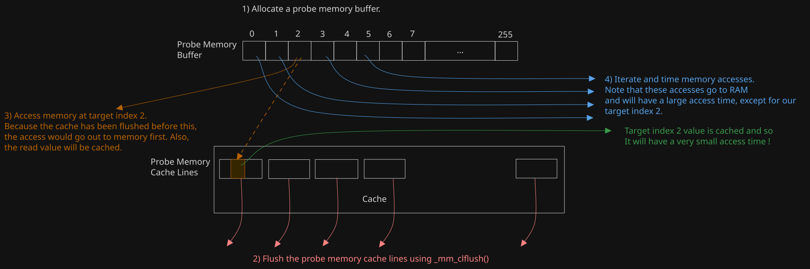

We load index 2 and then iterate over the probe memory. Because index 2 was read, it is already cached and when we read index 2 of the probe memory, it will be a cache hit and we will
record a very small access time. But, if we try this with a simple char/int/long probe buffer, things will not quite play out as expected. This is because we have not accounted for one caching behaviour in our approach - **prefetching** . When we perform the probe memory access at index 2 after the flush, the CPU along with fetching index 2, will prefetch indices 3,4,5,6.... as well from memory and cache them(recall spatial locality). Thus, when you will access the probe buffer, indices 3,4,5 and so on will also be cache hits along with index 2
and the outcome will be like this -

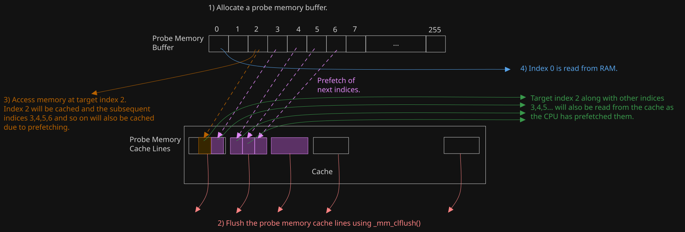

We do not want that. We want only index 2 to be a cache hit and not anything else. So, how do we get around this CPU prefetching behaviour? 
Well, one property about prefetching is that a **prefetch does not cross page boundaries and is restricted within a single page**. So, instead of allocating an array of bytes,
we will allocate 256 contiguous pages using `mmap()` system call, as our probing memory and then for each index value 0 to 255, access the corresponding page. That way we can
isolate target cache lines from each other and nullify the effect of prefetching on them, which gets rid of the noise and ensures that only our target index is a cache hit, while
all the remaining probes access the RAM.

With this change, our flush and reload technique will be like this - 

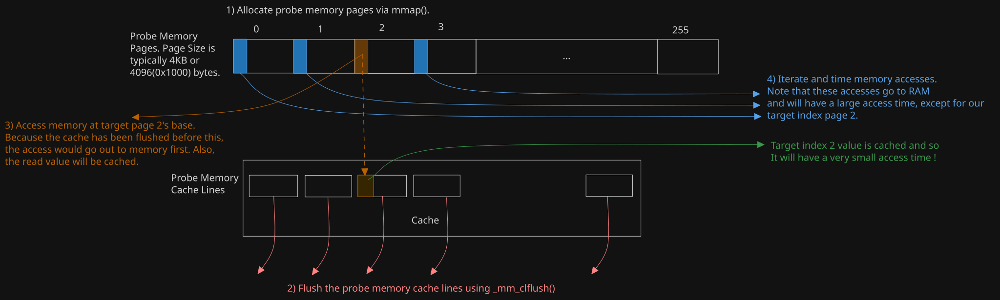

Also, one extra step that we are going to do when we probe the probe memory to identify the cache hit is that we will **not iterate sequentially over the probe pages**. We will iterate over it out of order like for example page index 1,3,8,2 and so on. This is an extra measure that we take so as to not trigger any other prefetching behaviour which the
CPU may take when we access page base addresses in sequence.

### Implementing Flush and Reload

With the approach fully sorted out, we can now implement the above strategy in a program which will make an access at a target index of our choosing and then record the the memory 
access time for each index and save the timing data in a file which we will analyse using python.

The `setup()` function below does two things - Pin the process to a specific CPU core so that we work with only one specific CPU core and its L1 cache and secondly, allocate 256 probe pages and return the base address pointer. `setup()` initializes the probe memory and will be called before starting the flush and reload.

```C
char* setup()
{
        //Pin the process to one CPU core. This is done because L1 cache is core specific and 
        //we do not want to end up in a CPU core whose L1 cache we have not prepared.
        cpu_set_t set;
        CPU_ZERO(&set);
        CPU_SET(1,&set);

        //Map 256 4 KB pages to use as our probe memory
        char* probe_memory_base = (char*)mmap((void*)0x1337000 ,
                        0x1000 * 256 ,
                        PROT_READ | PROT_WRITE ,
                        MAP_PRIVATE | MAP_ANONYMOUS ,
                        -1,
                        0
                        );
        if(!probe_memory_base)
        {
                printf("mmap() failed. Exiting...\n");
                exit(-1);
        }
        return probe_memory_base;
}
```

Next, we define the `flush_probe_cache_lines` function which takes in the probe memory base address as a parameter and then flushes the cache lines of the pages with a stride of
0x1000 which is the page size. This function implements the 'flush' part of our attack.

```C
void flush_probe_cache_lines(char* probe_memory_base)
{
        for(int i=0 ; i < 256; ++i)
        {
                void* addr = (void*)(probe_memory_base + (0x1000 * i));
                _mm_clflush(addr);
        }
}
```

As discussed previously, the implementation of the access time measuring - done by `measure_access_time` function is as follows. It takes in a target memory address to access and 
returns the time taken to complete the access.

```C
const uint64_t measure_access_time(volatile char* target_address)
{
        uint64_t start , end;

        _mm_lfence();
        start = __rdtsc();
        _mm_lfence();

        volatile char x = *target_address;

        _mm_lfence();
        end = __rdtsc();

        return end - start;
}
```

Next, we have the probing logic, which probes the probe memory pages and gathers access time data. This is the `probe_the_probe_memory()` function. It takes in the probe memory
base address and the timing data buffer address as arguments and it iterates over the probe pages, calculates the access time and records it in the timing data buffer. Note the 
`mix_i` index, which is calculated from the current index. This is done in order to make the access non-sequential as discussed in the previous section. The masking with 0xff ensures 
that `mix_i` does not go beyond 255.

```C
void probe_the_probe_memory(char* probe_memory_base , uint64_t* access_time_array)
{
        for(int i=0 ; i < 256 ; ++i)
        {
                int mix_i = ((i * 167) + 13) & 0xFF;
                char* addr = probe_memory_base + (0x1000 * mix_i);
                access_time_array[mix_i] = measure_access_time(addr);
        }
}
```

Now we have the timing data saving logic, implemented in the `serialize_timing_data_to_file()` function. This takes a file name and the timing data buffer with the recorded access
times and saves it in the file by serializing it in JSON format. The `access_times` key in the JSON object holds the list of access times that were recorded as its value.
We will process this file after running this, using a python script.

```C
void serialize_timing_data_to_file(const char* filename , uint64_t* time_array)
{
        FILE* fptr = fopen(filename , "w");
        if(!fptr)
        {
                printf("Error opening output data file.");
                return;
        }

        fprintf(fptr, "{\n\t");
        fprintf(fptr,"\"access_times\" : [");
        for(int i=0 ; i < 256; ++i)
        {
                fprintf(fptr , "%lli" , time_array[i]);
                if(i < 255) fprintf(fptr , ",");
        }

        fprintf(fptr,"]\n}");
        fclose(fptr);
}
```

Also, just a small detail. There is another helper function called `ensure_probe_memory_pages_mapped()` function. This function ensures that the probe memory pages are committed and
backed by physical pages by writing to it. `mmap()` only reserves the virtual address space for the probe memory, but pages are not committed until they are accessed. So before 
starting the flush and reload, we call this function to ensure the probe memory is mapped, in order to get more uniform timing data, and accesses do not take very long due to
page faults.

```C
void ensure_probe_memory_pages_mapped(char* probe_memory_base)
{
        for(int i=0; i < 256; ++i)
        {
                char* addr = probe_memory_base + (0x1000 * i);
                *addr = 1;
        }
}
```

Putting all these together, we can implement the flush and reload technique in the `main()` function.

```C
int main()
{
        uint64_t timing_data[256] = {0}; //Timing data buffer
        int target_index = 0x41;  // Target index 65

        //Initial setup - Allocate probe memory pages and ensure they are committed
        char* probe_memory_base = setup();
        ensure_probe_memory_pages_mapped(probe_memory_base);

        //Probe address corresponding to target_index
        volatile char* addr = probe_memory_base + (target_index * 0x1000);

        //Flush cache lines
        flush_probe_cache_lines(probe_memory_base);

        //Reload data from the target page
        volatile char x = *addr;

        // Probe the probe pages and collect timing data
        probe_the_probe_memory(probe_memory_base , timing_data);

        //Serialize the timing data to the JSON file
        serialize_timing_data_to_file("./probe_access_times.json" , timing_data);
        
        puts("Flush and Reload Complete. Check the JSON file.");
        
        return 0;
}
```

You can find the full program over [here](https://github.com/0xssriv/microarch_attacks/blob/main/part2/cache_profiler.c). It is named cache_profiler.c . On compiling and running the above program, we get this result.

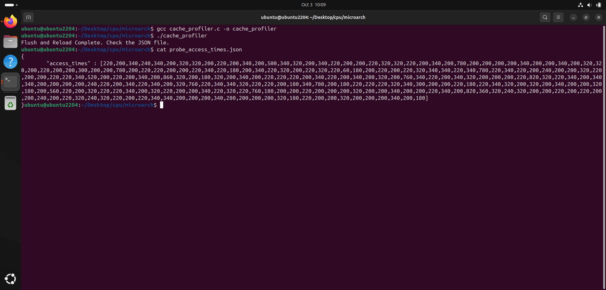

As we see above, when we see the file contents, we see the array of access time data in JSON format. Now, lets analyse the data.

### Analysing the Timing Data

We will process the timing data above by deserializing the JSON into a python dictionary. From there we will extract the timing data list and graph it using matplotlib and also
compute some metrics to get an idea of the data trends of the access times.

```python
import sys
import json
from matplotlib import pyplot as plt


with open(sys.argv[1] , "r") as f:
    timing_data = json.load(f)

y_axis_access_times = timing_data['access_times']
x_axis_index = list(range(len(y_axis_access_times)))

plt.xlabel("Index")
plt.ylabel("Access Time")
plt.title("CPU Memory Access Profiling")
plt.grid(True)

plt.plot(x_axis_index , y_axis_access_times)

least_access_time = min(y_axis_access_times)
idx_of_min_access = [idx for idx,t in enumerate(y_axis_access_times) if t == least_access_time][0]
average_acc_time = sum(y_axis_access_times)/len(y_axis_access_times)

print(f"Least access time is at index {idx_of_min_access} and is {least_access_time} CPU ticks.")
print(f"Average access time = {average_acc_time}")

plt.show()
```

On running the script, we see this result and graph.

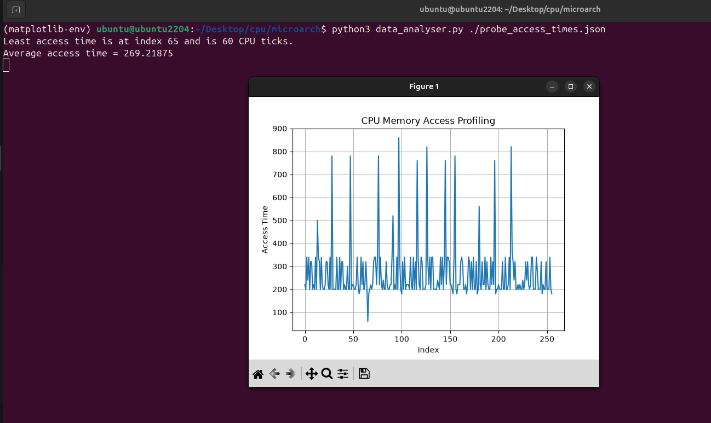

We see that the least access time is 60 CPU clock ticks and it occurs exactly at our target index 65(0x41). Now that by itself doesn't tell much .But, on seeing this least access time in the bigger context of the access times of the other indices, we begin to see something interesting. Take a look at the graph that is plotted. The y-axis is the access time and
the x-axis is the index.

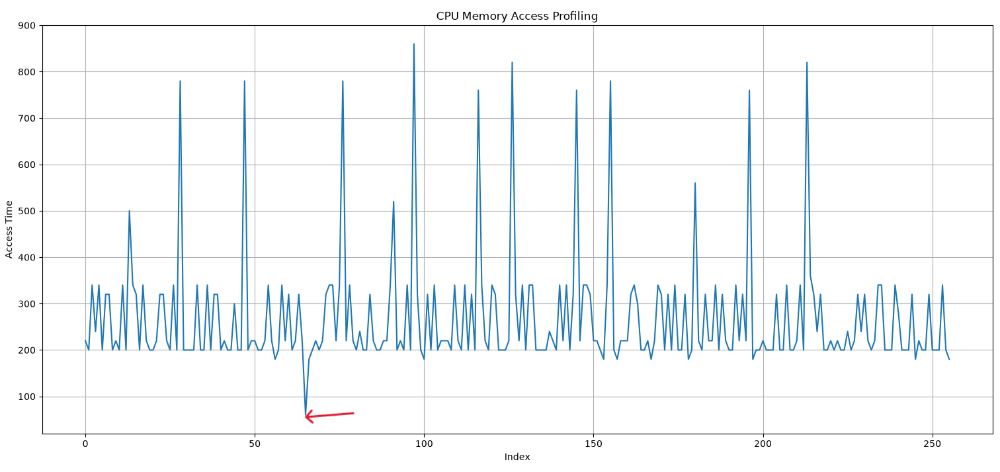

Notice the single sharp dip which goes below 100 ticks between indices 50 to 100. The red arrow points to that lowest dip. We know that this is 60 clock ticks and it happens at index
65 which is the target index we chose in our program. No other index has its access time below 100. The average memory access time comes to be about 270 clock ticks as calculated.
Now if you see, the highest access times come out to be between 700 to 900 as seen by those upward spikes. And the consistent sequence of small access times are seen to be close to 200 clock ticks with a few of these being not that below 200, they are like 170 180ish. But there is this one single outlier, in all of these 256 readings, that has its access time below
100 and is exceptionally lesser than the rest, and that outlier is at our target index which we reloaded after flushing the cache.

Now, because we flushed all the probe cache lines, reloaded the data at our target index page which causes it to be cached, and then probed the probe memory again, we know that in all
those series of probings done, the cache hit was only at our target index, which has a drastically less time. The graph indeed clearly shows us that. No other index was cached and they
have a much higher access time as they were certainly read from RAM. So, we have just visualized what a cache hit looks like! In all that noisy data of memory access times, we
got a clear outlier that screams 'Cache Hit'.

### The Cache is an Oracle!

The above experiment also gives us an idea to just look at the access time and conclude whether it was a cache hit or a cache miss. Because only the cache hit has its access time
in two digits, we can say that the cache hit threshold for the system is 100 clock ticks.

If access time => 100 then **Cache Miss** and RAM was accessed!
If access time < 100 Then **Cache Hit** and the cache was accessed!

To get an idea of the numbers on your machine, you can repeat this profiling experiment on your machine multiple times. In my case, some of my runs showed a cache hit time of 
80 instead of 60 but it never went above 100 in all my runs, and I could settle on the cache hit threshold to be 100 clock ticks.

The profiling experiment shows us how the cache can be used as an oracle of information, because by just looking at the access time and checking it against the threshold we can 
conclude if data is either present or absent in the cache and in turn, this tells us whether that memory access was made before or not!

## Weaponizing The Cache

Now, we know how to check if memory accesses are cache hits or cache misses from access time but how does that help us? Well, think about how we had a target index and we accessed it 
and then we were able to tell from the access time itself on the graph and in our python data processing script that the cache hit was at our target index 65 and nowhere else. Lets 
build upon that. Say we are in this situation where we know a memory address which holds a sensitive or forbidden value which we are not allowed to see - like for example, data at 
a kernel address from userspace or the address of a cryptographic key stored securely in another process. We know the memory address but we do not have the permissions to read it.
Also, lets say we have the capability to control a process and we are able to allocate and use memory as desired, so we can allocate probe memory pages. How do we disclose the first 
byte at such an address? Because the address of the forbidden value is known, we can 'use' the byte value stored in it to index into the probe memory pages that we allocate prior to 
this and after that, we profile the probe cache lines to see at what index we have a cache hit based on the access time data, using our flush and reload strategy.

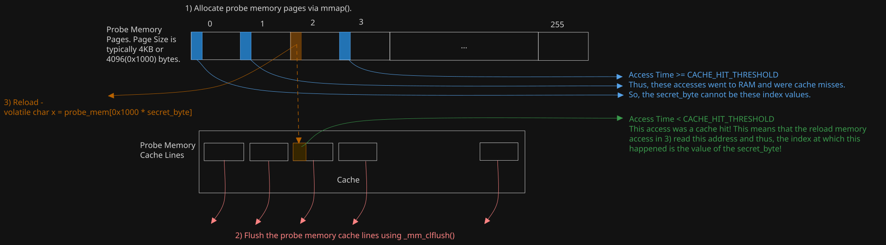

However, you will certainly still have a burning question - If the value stored at the address is forbidden, how are you using it? When you do that, you must segfault right? To answer this question, I must slightly get ahead of myself and tell you that the use of the 'forbidden' byte value as described above is in the **transient execution** of the probe memory 
page access instruction during the reload step of Flush and Reload. Before instruction execution becomes concrete, instructions execute 'transiently' and during transient execution
of the reload memory access, the forbidden byte from the memory address is **still read microarchitecturally** and then used within the transient execution of the reload instruction,
which will access the RAM and cache the read data. When the transient execution of the reload step becomes concrete, an exception is thrown and we get a segfault. 
This explanation is still quite handwavy, but do not worry, as the concept of **transient execution of instructions** will be discussed in depth in the next part of the blog series. 
The main thing to understand is that due to the way CPUs execute instructions, the CPU can still read data from forbidden memory areas microarchitecturally and leave side effects, 
but you never see the effects architecturally because the CPU throws an exception when it detects an access violation.

### Cache Me If You Can!

To sort of simulate the situation described above and how data presence in the cache encodes information which enables its use as a side channel, lets play a guessing game. 
We will generate a random byte and try to find it. Now of course we can simply generate and print out the byte, but we will not do that. Rather, we will set up our probing apparatus and use the cache to disclose this value via Flush and Reload and pretend that it is forbidden and we do not have the permissions to directly read it.

The guessing game program is very similar to the profiler program, but there is another newer function `get_hot_probe_cache_line()` . This function takes the timing data and checks
each access time to see which one is below the CACHE_HIT_THRESHOLD (100 as seen before) to identify the index at which the cache hit occured, and this would be the secret value we
are looking for.

```C
int get_hot_probe_cache_line(uint64_t* access_time_array)
{
        int hot_index=-1;
        for(int i=0; i < 256; ++i)
        {

                if(access_time_array[i] < CACHE_HIT_THRESHOLD)
                {
                        hot_index = i;
                }
        }
        return hot_index;
}
```
The `main()` function is as follows - 

```C
int main()
{
        char* probe_memory_base = setup();

        srand(time(NULL));
        uint64_t timing_data[256] = {CACHE_HIT_THRESHOLD};
        int secret_byte = 0x2a + (rand() % 86);

        ensure_probe_memory_pages_mapped(probe_memory_base);

        volatile char* addr = probe_memory_base + (secret_byte * 0x1000);
        flush_probe_cache_lines(probe_memory_base);

        volatile char x = *addr;

        probe_the_probe_memory(probe_memory_base , timing_data);


        int guessed_index = get_hot_probe_cache_line(timing_data);

        printf("Guessed character = 0x%02x (%c)\n" , guessed_index , (char)guessed_index);
        printf("Secret character = 0x%02x (%c)\n" , secret_byte, (char)secret_byte);

        return 0;
}
```

As you can see, it is not very different from our profiler. At the last, we get the guessed byte value and print it along with the actual secret character to see if they match.
Also, you see that the secret byte is from 0x2a to 0x80. Is is not necessary to do that. This is just done so that the random characters are printable for the most part.
You can alternatively write `int secret_byte = rand() & 0xff` if you want.

The full program can be found [here](https://github.com/0xssriv/microarch_attacks/blob/main/part2/guessing_game.c) in guessing_game.c

On compiling and running the above program, we see this

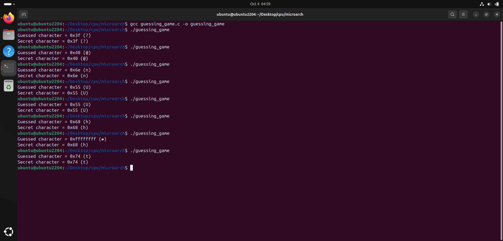

We see that on running it a couple of times, we consistently guess the generated character correctly! There was one instance where our guess was 0xffffffff and we failed to guess.
That is why we do not do such attacks just once, but rather repeat it multiple number of times to see which guess has the most frequency.

## Conclusion

We have seen in depth, the CPU cache and more importantly, how the cache becomes an oracle and a side channel of information, through which we can indirectly know data which 
we were never supposed to know. A thorough understanding of how timing based cache side channel attacks disclose information is essential to understanding how attacks like meltdown 
and spectre work, and I hope this blog has been helpful to you in understanding it. In the next part, we will look at Meltdown.

## References

- https://www.youtube.com/watch?v=zF4VMombo7U
- https://www.youtube.com/watch?v=7yrK_9PderQ
- https://en.wikipedia.org/wiki/Memory_barrier
- https://meltdownattack.com/meltdown.pdf (Sections 2.3 and 3) 

**Next** : [CPU Side Channel Attacks Part III - Meltdown]()

